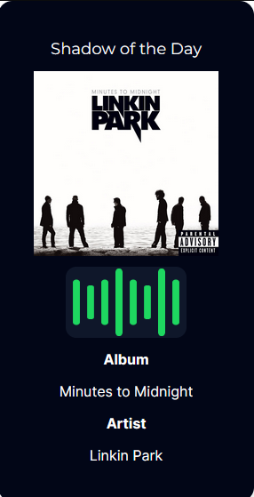

# SpotiPlaying

## You can see the development progress on the dev branch!

This is a small project I'm making to create an embeded option so you can add to any of your html projects!.  
I'm creating this app using:
- ReactJS
- NextJS
- Spotify API

## What's already done?
- Connecting the api with the app
- Deploying the user playing information
- Design of the now playing (still missing some stuff and might change)
### Image of how it looks at the moment


## What's missing?
- The main problem right now it's how to obfuscate the user auth token, since I don't want to expose it on the url I'm trying to figure out a relationship between userid and auth token using vercel databases. Might end up changing the provider depending on if I figure out something.  
- Personalization of the card
- Converting HTML to IMG, I'm still searching for a library to do this!
- Figuring out how to refresh the token since right now I think it dies at 1 hour and you'll need to re-login to acess the embed.

## Run on local
This is a [Next.js](https://nextjs.org/) project bootstrapped with [`create-next-app`](https://github.com/vercel/next.js/tree/canary/packages/create-next-app).

## Getting Started

First, run the development server:

```bash
npm run dev
# or
yarn dev
# or
pnpm dev
# or
bun dev
```

Open [http://localhost:3000](http://localhost:3000) with your browser to see the result.

You can start editing the page by modifying `app/page.tsx`. The page auto-updates as you edit the file.

This project uses [`next/font`](https://nextjs.org/docs/basic-features/font-optimization) to automatically optimize and load Inter, a custom Google Font.

## Learn More

To learn more about Next.js, take a look at the following resources:

- [Next.js Documentation](https://nextjs.org/docs) - learn about Next.js features and API.
- [Learn Next.js](https://nextjs.org/learn) - an interactive Next.js tutorial.

You can check out [the Next.js GitHub repository](https://github.com/vercel/next.js/) - your feedback and contributions are welcome!

## Deploy on Vercel

The easiest way to deploy your Next.js app is to use the [Vercel Platform](https://vercel.com/new?utm_medium=default-template&filter=next.js&utm_source=create-next-app&utm_campaign=create-next-app-readme) from the creators of Next.js.

Check out our [Next.js deployment documentation](https://nextjs.org/docs/deployment) for more details.
