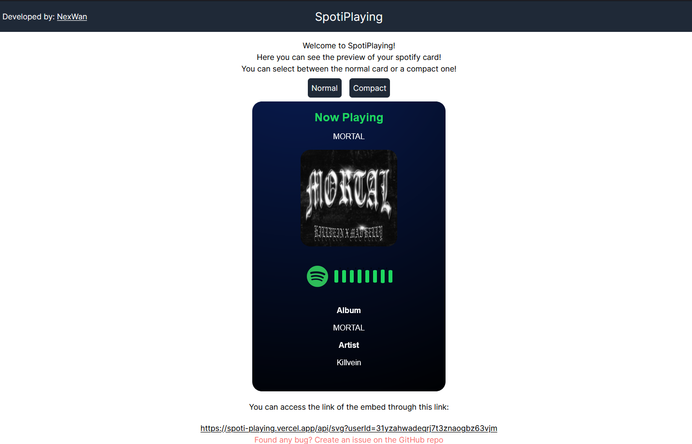

# SpotiPlaying

## You can see the development progress on the dev branch!

This is a small project I'm making to create an embeded option so you can add to any of your html projects!.  
I'm creating this app using:
- ReactJS
- NextJS
- Spotify API
- Vercel
- Postgresql Serverless (from vercel)

## What's already done?
- Connecting the api with the app
- Deploying the user playing information
- Design of the now playing (still missing some stuff and might change)
- Refresh token is working
- Recently played songs now are working
- Connection between the database and cookies are probably working (not fully tested yet)
## Main page (at the moment)
  



## Full Version
  

## Compact Version


As you can see it uses url?userId=.... in order to fetch the user last played instead of exposing your auth token!

## What's missing?
- ~~The main problem right now it's how to obfuscate the user auth token, since I don't want to expose it on the url I'm trying to figure out a relationship between userid and auth token using vercel databases. Might end up changing the provider depending on if I figure out something.~~ 
- Personalization of the card
- ~~Converting HTML to IMG, I'm still searching for a library to do this!~~
- ~~Figuring out how to refresh the token since right now I think it dies at 1 hour and you'll need to re-login to acess the embed.~~

## Run on local
This app runs on ReactJS and uses NextJS as it's backend, so you'll need to:
- Fork the project
- Create a vercel project based on the fork
- Create a serverless postgresql database on vercel
- Create a spotify developer account  

You can see the steps a bit more detailed down belos.

## Creating a vercel project.
You'll need to create your acount at [vercel](https://vercel.com) and select deploy a project, there you'll select the fork.  
Once you have deployed it then you'll need to create the postgresql database.

## Creating the database
It's pretty simple following [vercel documentation](https://vercel.com/docs/storage), once you have setup your database this is the only table it uses:
```sql
CREATE TABLE spotiuser (
        "user_id" VARCHAR(255) NOT NULL,
        "access_token" VARCHAR(255) NOT NULL,
        "refresh_token" VARChAR (255) NOT NULL,
        CONSTRAINT pk_userid PRIMARY KEY("user_id") 
)
```
Then follow the steps that vercel gives you to link the project from your console to the database on vercel, make sure you import from vercel the enviroment variables, which speaking of you'll need 2 env variables:  
```js
NEXT_PUBLIC_SPOTIFY_CLIENT_ID: 'your_spotify_client_id'
NEXT_PUBLIC_SPOTIFY_CLIENT_SECRET: 'your_spotify_client_secret'
```
Make sure you import your variables to the project too.

## Spotify developer
Just go into [Spotify developer page](https://developer.spotify.com/) and create your account, then you'll need to create a new project, make sure to follow the steps of spotify documentation to setup your callback and select WEB API and WEB API SDK.